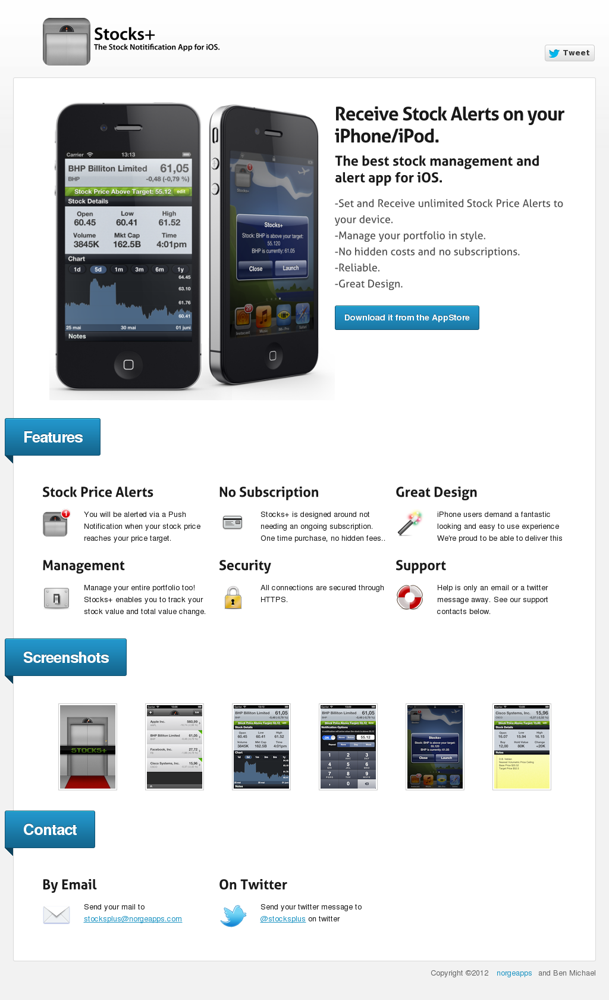

# Stocks+ iPhone App

## About Open Source of App
Opened source in 2021 from an old zip I made on 26/11/2015. Code is from ca 2012. Roughly app version 1.1
Frontend is all early iPhone (iPhone 4 era)
Backend is all python for google app engine. This was all new to be at the time, so the code is likely atrocious.

## Screenshot of Website

## Description

Stocks+ (Stocks Plus) alerts your device when a stock hits your target price.
Manage your portfolio in style with Stocks+
Reliable notification service with a functional and attractive interface.

Add a stock, set a price target, and you are done. 
You will receive a push notification when the stock hits the target price.

Features:
- Alert on Stock Target Price
- Manage your portfolio
- Great Charts
- Unlimited Notifications
- No Subscription! No hidden costs
- Supports Exchanges Worldwide (Yahoo Code Format)👍 
- Optional repeating notifications
- Easy and Fun to use
- Great Design

